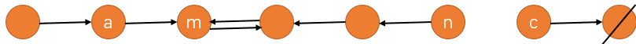
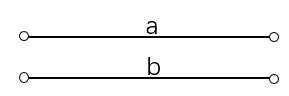
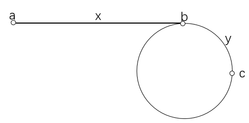

# AcWing 2019暑期LeetCode刷题班 


### 活动详情
- 本活动组织暑期刷LeetCode题目。
- 我们会精选80道高频题，每周10道，持续八周，每周一个专题。
- 每周日北京时间19:00-21:00直播讲本周布置的题目。直播录像会上传到b站。

### 激励机制
- 报名时收取80元报名费，活动结束一个月内，打卡60%题目，会全额返报名费！
- 题目以周为单位，只要本周做完6道题目，则会立即返 80 / 8 = 10元，最晚24小时到账。

### 参与方式
- 每天写完相应题目后，在”打卡”栏目（报名后可见）中选择对应位置，提交Accept的代码即可。
- 如果刷题时遇到任何问题，可以在问答页面发帖提问，我们会第一时间解答。

### 活动交流
- 欢迎加入我们的微信群！
- 添加我们的acwing微信小助手，留言“暑期LeetCode打卡活动”，微信号是acwinghelper。
- 或者加入QQ群：728297306。

### 报名方式
- [活动报名链接](https://www.acwing.com/activity/content/12/): https://www.acwing.com/activity/content/12/


<div style="page-break-after: always;"></div>

# Week1 二分


- 69. Sqrt(x)
- 35. 查找插入位置
- 34. 查找数的范围
- 74. 在二维矩阵中查找
- 153. 查找最小值
- 33. 搜索旋转排序数组
- 278. 第一个失败版本
- 162. 查找峰值
- 287. 查找重复元素
- 275. H-索引II


<div style="page-break-after: always;"></div>


## 二分1: Leetcode 69. Sqrt(x)

### 题目描述

请实现 `int sqrt(int x)`。

请计算并返回 `x` 的正平方根，保证 `x` 是一个非负整数。
注意返回类型是整数，所以我们只返回正平方根的整数部分。

#### 样例1

```
输入：4
输出：2
```

#### 样例2

```
输入：8
输出：2
解释：8的正平方根是 2.82842...，它的整数部分是2.
```


----------

### 算法
##### (二分)  `O(logx)`

二分出最大的 `y`，满足 `y^2 <= x`。
则 `y` 就是答案。

时间复杂度分析：二分的时间复杂度是 `O(logx)`。


#### C++ 代码
```
class Solution {
public:
    int mySqrt(int x) {
        int l = 0, r = x;
        while (l < r)
        {
            int mid = (l + 1ll + r) / 2;
            if (mid <= x / mid) l = mid;
            else r = mid - 1;
        }
        return l;
    }
};
```

<div style="page-break-after: always;"></div>

## 二分2: Leetcode 35. 查找插入位置

### 题目描述

* 给定一个升序的数组和目标值，如果数组中含有目标值，则返回位置；否则返回插入的位置使得插入后仍满足升序。
* 假设数组中没有重复元素。


### 样例

```
Input: [1,3,5,6], 5
Output: 2

Input: [1,3,5,6], 2
Output: 1

Input: [1,3,5,6], 7
Output: 4

Input: [1,3,5,6], 0
Output: 0
```


----------

### 算法
##### (二分)  `O(logn)`

1. 直接二分查找小于等于目标值的第一个位置。
2. 如果`nums[l] >= target`，说明找到了`target`或者数组中所有元素都比`target`小，则返回`l`
3. 否则说明数组所有元素都比`target`大，此时`l`一定是`0`，故返回`l`。

### 时间复杂度
* 二分的时间复杂度`O(logn)`。


#### C++ 代码
```
class Solution {
public:
    int searchInsert(vector<int>& nums, int target) {
        int n = nums.size();
        if (n == 0)
            return 0;
        int l = 0, r = n - 1;
        while (l < r) {
            int mid = (l + r) >> 1;
            if (nums[mid] < target)
                l = mid + 1;
            else
                r = mid;
        }
        if (nums[l] >= target)
            return l;
        return l + 1;
    }
};

```

<div style="page-break-after: always;"></div>

## 二分3: Leetcode 34. 查找数的范围


### 题目描述


* 给出一个升序的整型数组，返回某个元素的起始位置和终止位置。
* 若不存在则返回`[-1, -1]`。

### 样例
```
Input: nums = [5,7,7,8,8,10], target = 8
Output: [3,4]

Input: nums = [5,7,7,8,8,10], target = 6
Output: [-1,-1]
```

### 额外要求
* 时间复杂度要求`O(logn)`。

----------

### 算法
##### (两次二分)  `O(logn)`

1. 第一次二分查找第一个小于等于`target`的位置，若该位置不等于`target`，则返回`[-1, -1]`。
2. 第二次二分查找第一个大于`target`的位置。注意需要特判边界。

### 时间复杂度
两次二分时间复杂度为`O(logn)`。

#### C++ 代码
```
class Solution {
public:
    vector<int> searchRange(
            vector<int>& nums, int target) {
        int n = nums.size();
        if (n == 0)
            return vector<int>({-1, -1});
        int l = 0, r = n - 1;
        int start, end;
        while (l < r) {
            int mid = (l + r) >> 1;
            if (nums[mid] < target)
                l = mid + 1;
            else
                r = mid;
        }
        if (nums[l] != target)
            return vector<int>({-1, -1});
        
        start = l;
        
        l = 0; r = n - 1;
        while (l < r) {
            int mid = (l + r) >> 1;
            if (nums[mid] <= target)
                l = mid + 1;
            else
                r = mid;
        }
        if (nums[l] > target)
            end = l - 1;
        else
            end = l;
        return vector<int>({start, end});
    }
};

```

<div style="page-break-after: always;"></div>

## 二分4: Leetcode 74. 在二维矩阵中查找


### 题目描述

写一个高效算法，在矩阵中查找一个数是否存在。矩阵有如下特点：

- 矩阵中每行的数，从左到右单调递增；
- 每行行首的数大于上一行行尾的数；


#### 样例1

```
输入：
matrix = [
  [1,   3,  5,  7],
  [10, 11, 16, 20],
  [23, 30, 34, 50]
]
target = 3
输出： true
```

#### 样例2

```
输入：
matrix = [
  [1,   3,  5,  7],
  [10, 11, 16, 20],
  [23, 30, 34, 50]
]
target = 13
输出：false
```


----------

### 算法
##### (二分)  `O(logn)`

我们可以想象把整个矩阵，按行展开成一个一维数组，那么这个一维数组单调递增，然后直接二分即可。
二分时可以通过整除和取模运算得到二维数组的坐标。

时间复杂度分析：二分的时间复杂度是 `O(logn^2) = O(logn)`。


#### C++ 代码
```
class Solution {
public:
    bool searchMatrix(vector<vector<int>>& matrix, int target) {
        if (matrix.empty() || matrix[0].empty()) return false;
        int n = matrix.size(), m = matrix[0].size();
        int l = 0, r = n * m - 1;
        while (l < r)
        {
            int mid = (l + r) / 2;
            if (matrix[mid / m][mid % m] >= target) r = mid;
            else l = mid + 1;
        }
        return matrix[r / m][r % m] == target;
    }
};
```

<div style="page-break-after: always;"></div>

## 二分5: Leetcode 153. 查找最小值


### 题目描述

现有一个有序数组，假设从某个数开始将它后面的数按顺序放到了数组前面。
(即 `[0,1,2,4,5,6,7]` 可能变成 `[4,5,6,7,0,1,2]`)。

请找出数组中的最小元素。

数组中不包含重复元素。


#### 样例1

```
输入：[3,4,5,1,2] 
输出：1
```

#### 样例2

```
输入：[4,5,6,7,0,1,2]
输出：0
```


----------

### 算法
##### (二分)  `O(logn)`

处理这种问题有个常用技巧：如果不想处理边界情况，比如当数组只有两三个数的时候，代码会出问题。我们可以在数组长度太短(这道题中我们判断数组长度小于5)时，直接暴力循环做；数组有一定长度时再用二分做。
这样做并不会影响算法的时间复杂度，但会缩短写代码的时间。

为了便于理解，我们将数组中的数画在二维坐标系中，横坐标表示数组下标，纵坐标表示数值，如下所示：


我们会发现数组中最小值前面的数 `nums[i]` 都满足：`nums[i] >= nums[0]`，其中 `nums[n-1]` 是数组最后一个元素；而数组中最小值后面的数（包括最小值）都不满足这个条件。
所以我们可以二分出最小值的位置。

另外，不要忘记处理数组完全单调的特殊情况。

时间复杂度分析：二分查找，所以时间复杂度是 `O(logn)`。


#### C++ 代码
```
class Solution {
public:
    int findMin(vector<int>& nums) {
        if (nums.back() > nums[0]) return nums[0];
        int l = 0, r = nums.size() - 1;
        while (l < r)
        {
            int mid = l + r >> 1;
            if (nums[mid] >= nums[0]) l = mid + 1;
            else r = mid;
        }
        return nums[l];
    }
};
```

<div style="page-break-after: always;"></div>

## 二分6: Leetcode 33. 搜索旋转排序数组

### 题目描述

* 假设一个升序数组以某个轴做了旋转，例如`[0,1,2,4,5,6,7]`可能变为`[4,5,6,7,0,1,2]`，在其中检索某个值是否存在。
* 若存在返回位置，否则返回`-1`。


### 样例

```
input:
nums = [4,5,6,7,0,1,2], target = 0
output: 4

input:
nums = [4,5,6,7,0,1,2], target = 3
output: -1
```

### 额外要求
* 时间复杂度必须是`O(logn)`。

----------

### 算法1
##### (三次二分检索)  `O(logn)`

1. 数组长度为`0`和`1`时的特判处理。
2. 首先二分出是以哪个元素分割数组两部分的。具体为，每次二分时，如果`nums[mid]>=nums[l]&&nums[mid]>=nums[r]`，则`l=mid+1`；如果`nums[mid]<=nums[l]&&nums[mid]<=nums[r]`，则`r=mid`；否则`break`。最终数组分为`[0, l-1]`和`[l, n-1]`两段区间。
3. 然后再在两段区间分别二分找`target`即可。

### 时间复杂度
* 三次二分检索，时间复杂度是`O(logn)`。

#### C++ 代码
```
class Solution {
public:
    int search(vector<int>& nums, int target) {
        int n = nums.size();
        if (n == 0)
            return -1;
        if (n == 1)
            return nums[0] == target ? 0 : -1;
        
        int l = 0, r = n - 1, pivot;
        while (l < r) {
            int mid = (l + r) >> 1;
            if (nums[mid] >= nums[l] && nums[mid] >= nums[r])
                l = mid + 1;
            else if (nums[mid] <= nums[l] && nums[mid] <= nums[r])
                r = mid;
            else break;
        }
        pivot = l - 1;
        l = 0; r = pivot;
        while (l < r) {
            int mid = (l + r) >> 1;
            if (nums[mid] < target)
                l = mid + 1;
            else
                r = mid;
        }
        if (nums[l] == target)
            return l;
        
        l = pivot + 1; r = n - 1;
        while (l < r) {
            int mid = (l + r) >> 1;
            if (nums[mid] < target)
                l = mid + 1;
            else
                r = mid;
        }
        if (nums[l] == target)
            return l;
        return -1;
    }
};

```

----------

### 算法2
##### (一次二分检索)  `O(logn)`

1. 数组长度为`0`则直接返回`-1`。
2. 每一次二分，我们具体看一下什么时候答案可能在`[l, mid]`中，什么时候答案可能在`[mid+1, r]`中。
3. 注意到`num[0]`是个非常关键的元素，已知数组被分为`两个升序部分，且后半部分全部比nums[0]小`，如果`nums[i]>=nums[0]`则说明`[0, i]`一定是升序的，否则`[i+1, n-1]`一定是升序的。还可以根据`target`与`nums[0]`的关系，判断出`target`可能属于哪一部分。
4. 根据3，如果给定了一个位置`mid`，我们可以根据`nums[0]`、`nums[mid]`与`target`三者的关系，确定出`target`可能属于哪一段区间。具体看代码注释部分。

### 时间复杂度
* 只有一次二分检索，时间复杂度为`O(logn)`。


#### C++ 代码
```
class Solution {
public:
    int search(vector<int>& nums, int target) {
        int n = nums.size();
        if (n == 0)
            return -1;
        int l = 0, r = n - 1;
        while (l < r) {
            int mid = (l + r) >> 1;
            if (nums[mid] >= nums[0]) { // mid在数组前半部分。
                if (target > nums[mid])
                    // 可以推出target的值一定大于nums[0]，target只可能在[mid+1, r]中。
                    l = mid + 1;
                if (target < nums[0])
                    // 可以推出target的值一定小于nums[mid]，target只可能在[mid+1, r]中。
                    l = mid + 1;
                if (target <= nums[mid] && target >= nums[0])
                    // 此时target的值处于nums[0]和nums[mid]中，故可能在[l, mid]中。
                    r = mid;
            }
            else { // mid在数组后半部分
                if (target >= nums[0])
                    // 可以推出target的值一定大于nums[mid]，target只可能在[l, mid]中。
                    r = mid;    
                if (target <= nums[mid])
                    // 可以推出target的值一定小于nums[0]，target只可能在[l, mid]中。
                    r = mid;
                if (target > nums[mid] && target < nums[0])
                    // 此时target的值处于nums[0]和nums[mid]中，故可能在[mid+1, r]中。
                    l = mid + 1;
            }
        }
        return nums[l] == target ? l : -1;
    }
};
```

<div style="page-break-after: always;"></div>

## 二分7: Leetcode 278. 第一个失败版本

[//]: # (推荐题解模板，请替换blablabla等内容 ^^)

### 题目描述

你是一个产品经理，正在领导一个团队开发一款新的产品。很不幸，最新版本的产品在质检时失败了。由于每个版本的开发都是基于上一个版本的，所以从第一次质检失败的版本开始，之后所有的版本都会失败。

假设共有 `n` 个版本 `[1, 2, ..., n]`，现在请找出第一次失败的版本号。

给定一个API：`bool isBadVersion(version)` 可以返回 `version` 版本是否失败。请实现一个函数，找到第一个失败的版本号。你需要尽可能减少调用API的次数。


#### 样例

```
给定 n = 5, version = 4 是第一个失败的版本。

调用 isBadVersion(3) -> false
调用 isBadVersion(5) -> true
调用 isBadVersion(4) -> true

所以4是第一个失败的版本。
```


----------

### 算法
##### (二分)  `O(logn)`

整个序列可以分为两段，前半段都是成功的版本，后半段都是失败的版本。所以该问题具有二分性质，直接二分即可。

时间复杂度分析：二分检索只会调用 `logn` 次API，所以时间复杂度是 `O(logn)`。


#### C++ 代码
```
// Forward declaration of isBadVersion API.
bool isBadVersion(int version);

class Solution {
public:
    int firstBadVersion(int n) {
        int l = 1, r = n;
        while (l < r)
        {
            int mid = (l + 0ll + r) / 2;
            if (isBadVersion(mid)) r = mid;
            else l = mid + 1;
        }
        return r;
    }
};
```

<div style="page-break-after: always;"></div>

## 二分8: Leetcode 162. 查找峰值

[//]: # (推荐题解模板，请替换blablabla等内容 ^^)

### 题目描述

峰值定义为比左右相邻元素大的元素。

给定一个数组 `nums`，保证 `nums[i] ≠ nums[i+1]`，请找出该数组的峰值，并返回峰值的下标。

数组中可能包含多个峰值，只需返回任意一个即可。

假定 `nums[-1] = nums[n] = -∞`。


#### 样例1

```
输入：nums = [1,2,3,1]
输出：2
解释：3是一个峰值，3的下标是2。
```

#### 样例2

```
输入：nums = [1,2,1,3,5,6,4]
输出：1 或 5 
解释：数组中有两个峰值：1或者5，返回任意一个即可。
```


----------

### 算法
##### (二分)  `O(logn)`

仔细分析我们会发现：

- 如果 `nums[i-1] < nums[i]`，则如果 `nums[i-1], nums[i], ... nums[n-1]` 是单调的，则 `nums[n-1]`就是峰值；如果`nums[i-1], nums[i], ... nums[n-1]`不是单调的，则从 `i` 开始，第一个满足 `nums[i] > nums[i+1]`的 `i` 就是峰值；所以 `[i,n-1]` 中一定包含一个峰值；
- 如果 `nums[i-1] > nums[i]`，同理可得 `[0, i-1]` 中一定包含一个峰值；

所以我们可以每次二分中点，通过判断 `nums[i-1]` 和 `nums[i]` 的大小关系，可以判断左右两边哪边一定有峰值，从而可以将检索区间缩小一半。

时间复杂度分析：二分检索，每次删掉一半元素，所以时间复杂度是 `O(logn)`。


#### C++ 代码
```
class Solution {
public:
    int findPeakElement(vector<int>& nums) {
        if (nums.size() == 1 || nums[0] > nums[1]) return 0;
        int l = 1, r = nums.size() - 1;
        while (l < r)
        {
            int mid = (l + r + 1) / 2;
            if (nums[mid] > nums[mid - 1]) l = mid;
            else r = mid - 1;
        }
        return l;
    }
};
```

<div style="page-break-after: always;"></div>

## 二分9: Leetcode 287. 查找重复元素

[//]: # (推荐题解模板，请替换blablabla等内容 ^^)

### 题目描述


给定一个数组 _nums_ 包含 _n_ + 1 个整数，每个整数在 1 到 _n_ 之间，包括 1 和 _n_。现在假设数组中存在一个重复的数字，找到该重复的数字。

#### 注意
* **不能**修改数组元素，假设数组是只读的。
* 仅可以使用常数即`O(1)`的额外空间。
* 时间复杂度需要低于`O(n^2)`。
* 数组中仅有一个重复数字，但它可能重复超过1次。

#### 样例

```
Example 1:

Input: [1,3,4,2,2]
Output: 2
```
```
Example 2:

Input: [3,1,3,4,2]
Output: 3
```


----------

### 算法
##### (双指针移动)  `O(n)`

1. 因为每个数都是 1 到 _n_，所以此题可以当做[Linked List Cycle II](https://leetcode.com/problems/linked-list-cycle-ii/description/)来处理。
2. 首先`first`和`second`指针均为0，然后`first`每次前进一格，`second`每次前进两格。`i前进一格`在这里指的是`nums[i]`。剩余部分请参考[Linked List Cycle II](https://leetcode.com/problems/linked-list-cycle-ii/description/)中的算法证明。

#### 时间复杂度
* 参见[Linked List Cycle II](https://leetcode.com/problems/linked-list-cycle-ii/description/)时间复杂度部分，整个数组仅遍历常数次，故时间复杂度为`O(n)`。


#### C++ 代码
```
class Solution {
public:
    int findDuplicate(vector<int>& nums) {
        int first = 0, second = 0;
        do {
            first = nums[first];
            second = nums[nums[second]];
        } while (first != second);
        
        first = 0;
        while (first != second) {
            first = nums[first];
            second = nums[second];
        }
        return first;
    }
};
```

<div style="page-break-after: always;"></div>

## 二分10: Leetcode 275. H-索引II

[//]: # (推荐题解模板，请替换blablabla等内容 ^^)

### 题目描述

给定一个科研工作者的一系列论文的引用次数（引用次数是非负整数），__已经从小到大排好序__，请计算他的h因子。

h因子的定义：一个科学家如果有 `h` 篇文章的引用次数至少是 `h`，并且其他文章的引用次数不超过 `h`，我们就说他的影响因子是 `h`。

__注意：__ 如果一个人有多个可能的 `h`，返回最大的 `h` 因子。

__进一步：__ 

- 这道题目是 [LeetCode 274. H-Index](https://www.acwing.com/solution/leetcode/content/329/)的升级版，`citations` 保证是严格递增的；
- 你能否给出时间复杂度是 `O(logn)` 级别的算法？


#### 样例

```
输入：所有文章的引用次数 = [0,1,3,5,6]
输出：3 
解释：[0,1,3,5,6] 表示一共有5篇文章，每篇文章分别被引用
      0, 1, 3, 5, 6次。由于共有3篇文章的引用次数大于等于3，
      且其他两篇文章的引用次数不超过3，所以h因子是3。
```


----------

### 算法
##### (二分)  `O(logn)`

由于数组是从小到大排好序的，所以我们的任务是：
在数组中找一个最大的 `h`，使得后 `h` 个数大于等于 `h`。

我们发现：如果 `h` 满足，则小于 `h` 的数都满足；如果 `h` 不满足，则大于 `h` 的数都不满足。所以具有二分性质。
直接二分即可。

时间复杂度分析：二分检索，只遍历 `logn` 个元素，所以时间复杂度是 `O(logn)`。


#### C++ 代码
```
class Solution {
public:
    int hIndex(vector<int>& citations) {
        if (citations.empty()) return 0;
        int l = 0, r = citations.size() - 1;
        while (l < r)
        {
            int mid = (l + r) / 2;
            if (citations.size() - mid <= citations[mid]) r = mid;
            else l = mid + 1;
        }
        if (citations.size() - l <= citations[l]) return citations.size() - l;
        return 0;
    }
};
```


<div style="page-break-after: always;"></div>


# Week2 链表


- 19. 删除第n个节点
- 237. 删除某个节点
- 83. 删除重复节点
- 61. 旋转链表
- 24. 交换相邻节点
- 206. 翻转链表
- 92. 翻转链表2
- 160. 两个链表的交点
- 142. 返回链表中环的入口
- 148. 链表排序

<div style="page-break-after: always;"></div>

## 链表1: Leetcode 19. 删除第n个节点

### 题目描述

给定一个单向链表，要求删除从结尾数第`n`个结点，并返回修改后的表头。
链表结点的定义如下：
```
struct ListNode {
    int val;
    ListNode *next;
    ListNode(int x) : val(x), next(NULL) {}
};
```


### 样例

```
给定数组单向链表 1->2->3->4->5 ，以及 n = 2 ，修改后的链表为 1->2->3->5。
```

### Note
1. `n`总是合法的。
2. 尝试使用一次遍历完成本题。


----------

### 算法1
##### (两次遍历)

1. 第一次遍历求出链表长度。
2. 第二次遍历删掉指定结点。
3. 注意删除头结点的特殊情况。

#### 时间复杂度 `O(L)`

#### 空间复杂度 `O(1)`

#### 运行结果
Accepted

#### C++ 代码
```
/**
 * Definition for singly-linked list.
 * struct ListNode {
 *     int val;
 *     ListNode *next;
 *     ListNode(int x) : val(x), next(NULL) {}
 * };
 */
class Solution {
public:
    ListNode* removeNthFromEnd(ListNode* head, int n) {
        int len = 0;
        for (ListNode *cur = head; cur != NULL; cur = cur -> next)
            len++;
        if (len == n)
            return head -> next;
        int cnt = 0;
        for (ListNode *cur = head; cur != NULL; cur = cur -> next) {
            cnt++;
            if (cnt == len - n) {
                cur -> next = cur -> next -> next;
                break;
            }
        }
        return head;
    }
};

```


----------

### 算法2
##### (一次遍历)

1. 在头部之前添加保护结点。
2. 设置两个指针`first`和`second`，均指向保护结点。
3. `first`指针先向后移动`n+1`个结点。
4. 然后`first`和`second`指针同时向后移动，直到`first`指针指向空，此时`second`结点指向的下一个结点需要删除。

解释：
始终保持两个指针之间间隔`n`个结点，在`first`到达终点时，`second`的下一个结点就是从结尾数第`n`个结点。

#### 时间复杂度 `O(L)`

#### 空间复杂度 `O(1)`

#### 运行结果
Accepted

#### 个人感想
此算法并不能真正算是一次遍历，也就是用两个指针同时遍历，算是投机取巧。

#### C++ 代码：
```
/**
 * Definition for singly-linked list.
 * struct ListNode {
 *     int val;
 *     ListNode *next;
 *     ListNode(int x) : val(x), next(NULL) {}
 * };
 */
class Solution {
public:
    ListNode* removeNthFromEnd(ListNode* head, int n) {
        ListNode* ext_head = new ListNode(0);
        ext_head -> next = head;
        
        ListNode* first = ext_head;
        ListNode* second = ext_head;
        
        for (int i = 0; i <= n; i++)
            first = first -> next;
        
        while (first != NULL) {
            first = first -> next;
            second = second -> next;
        }
        second -> next = second -> next -> next;
        
        return ext_head -> next;
    }
};

```

<div style="page-break-after: always;"></div>

## 链表2: Leetcode 237. 删除某个节点

[//]: # (推荐题解模板，请替换blablabla等内容 ^^)

### 题目描述

请编写一个函数，删除单链表中的一个节点（除了尾节点）。函数传入的参数是需要删除的节点的指针。

__注意：__

- 链表中至少包含两个节点；
- 所有节点的值互不相同；
- 给定的节点一定不是尾节点，且一定合法；
- 函数不需要返回任何值；

给定一个数组 `head = [4, 5, 1, 9]`，表示如下链表：
```
4 -> 5 -> 1 -> 9
```

#### 样例1

```
输入：head = [4,5,1,9], node = 5
输出：[4,1,9]
解释：给出第二个节点，值是5，将其删除后
      链表会变成 4 -> 1 -> 9.
```

#### 样例2

```
输入：head = [4,5,1,9], node = 1
输出：[4,5,9]
解释：给出第三个节点，值是1，将其删除后
      链表会变成 4 -> 5 -> 9.
```


----------

### 算法
##### (链表操作)  `O(1)`

由于是单链表，我们不能找到前驱节点，所以我们不能按常规方法将该节点删除。
我们可以换一种思路，将下一个节点的值复制到当前节点，然后将下一个节点删除即可。

时间复杂度分析：只有常数次操作，所以时间复杂度是 `O(1)`。


#### C++ 代码
```
/**
 * Definition for singly-linked list.
 * struct ListNode {
 *     int val;
 *     ListNode *next;
 *     ListNode(int x) : val(x), next(NULL) {}
 * };
 */
class Solution {
public:
    void deleteNode(ListNode* node) {
        node->val = node->next->val;
        node->next = node->next->next;
    }
};
```

<div style="page-break-after: always;"></div>

## 链表3: Leetcode 83. 删除重复节点

[//]: # (推荐题解模板，请替换blablabla等内容 ^^)

### 题目描述

给定一个有序链表，请删除其中的重复元素，使得原链表的元素仅出现一次。


#### 样例1

```
输入：1->1->2
输出：1->2
```

#### 样例2

```
输入：1->1->2->3->3
输出：1->2->3
```

----------

### 算法
##### (线性扫描) `O(n)`

从前往后扫描整个链表，如果一个节点和其后继节点相同，则直接删除后继节点，否则指针移动到后继节点。

时间复杂度分析：整个链表只扫描一遍，所以时间复杂度是 `O(n)`。


#### C++ 代码
```
/**
 * Definition for singly-linked list.
 * struct ListNode {
 *     int val;
 *     ListNode *next;
 *     ListNode(int x) : val(x), next(NULL) {}
 * };
 */
class Solution {
public:
    ListNode* deleteDuplicates(ListNode* head) {
        if (!head) return head;
        ListNode* p = head;
        while (p->next)
        {
            if (p->val == p->next->val) p->next = p->next->next;
            else p = p->next;
        }
        return head;
    }
};
```

<div style="page-break-after: always;"></div>

## 链表4: Leetcode 61. 旋转链表

[//]: # (推荐题解模板，请替换blablabla等内容 ^^)

### 题目描述

给定一个链表，将链表向右循环移动 `k` 次，`k` 是非负整数。


#### 样例1

```
输入：1->2->3->4->5->NULL, k = 2
输出：4->5->1->2->3->NULL
解释：
向右移动1步后：5->1->2->3->4->NULL
向右移动2步后：4->5->1->2->3->NULL
```

#### 样例2
```
输入：0->1->2->NULL, k = 4
输出：2->0->1->NULL
解释：
向右移动1步：2->0->1->NULL
向右移动2步：1->2->0->NULL
向右移动3步：0->1->2->NULL
向右移动4步：2->0->1->NULL
```

----------

### 算法
##### (模拟，链表)  `O(n)`

这道题中 `k` 可能很大，所以我们令 `k = k\%n`，`n`是链表长度。

为了避免处理边界问题，我们创建虚拟头结点，指向原链表的头结点。
然后创建两个指针`first, second`，分别指向虚拟头结点，先让`first`向后移动 `k` 个位置，然后`first`和`second`同时向后移动，直到`first`走到链表最后一个元素。
此时`first`指向链表末尾，`second`指向分界点。然后我们把链表从分界点处断开，然后把后半段接在前半段前面即可。

时间复杂度分析：链表一共遍历2遍，所以总时间复杂度是 `O(n)`。


#### C++ 代码
```
/**
 * Definition for singly-linked list.
 * struct ListNode {
 *     int val;
 *     ListNode *next;
 *     ListNode(int x) : val(x), next(NULL) {}
 * };
 */
class Solution {
public:
    ListNode* rotateRight(ListNode* head, int k) {
        if (!head) return head;
        
        int n = 0;
        ListNode *p = head;
        while (p)
        {
            n ++ ;
            p = p->next;
        }
        
        k %= n;
        if (!k) return head;
        
        ListNode *dummy = new ListNode(0);
        dummy->next = head;
        ListNode *first = dummy;
        while (k -- && first) first = first->next;
        ListNode *second = dummy;
        while (first->next)
        {
            first = first->next;
            second = second->next;
        }
        first->next = dummy->next;
        dummy->next = second->next;
        second->next = 0;
        return dummy->next;
    }
};

```
<div style="page-break-after: always;"></div>

## 链表5: Leetcode 24. 交换相邻节点

### 题目描述


给定一个单向链表，依次交换每一对相邻的两个结点，返回修好后的链表头结点。

链表结点的数据结构：
```
struct ListNode {
    int val;
    ListNode *next;
    ListNode(int x) : val(x), next(NULL) {}
};
```

### 样例

```
输入：1->2->3->4
输出：2->1->4->3
```

### 额外要求
不得修改链表中结点的`val`值，仅可以使用常数的空间。


----------

### 算法
##### (模拟)  `O(L)`

1. 添加虚拟头结点`dummy`。
2. 定义`cur`指针初始指向`dummy`。
3. 定义`first`为`cur->next`，`second`为`first->next`；若`first`或`second`为空，则终止循环。
4. 按照一定的次序，修改`cur`、`first`和`second`结点的`next`指针，具体参见代码。
5. 将`cur`指向修改后的`first`，接着从第3步循环。


#### 时间复杂度
仅遍历一遍所有结点，所以是`O(L)`。


#### 运行结果
Accepted (best)

#### C++ 代码
```
/**
 * Definition for singly-linked list.
 * struct ListNode {
 *     int val;
 *     ListNode *next;
 *     ListNode(int x) : val(x), next(NULL) {}
 * };
 */
class Solution {
public:
    ListNode* swapPairs(ListNode* head) {
        ListNode* dummy = new ListNode(0);
        dummy -> next = head;
        ListNode* cur = dummy;
        
        while (cur != NULL) {
            ListNode* first = cur -> next;
            if (first == NULL)
                break;
            
            ListNode* second = first -> next;
            if (second == NULL)
                break;
            
            // 按照一定的次序，交换相邻的两个结点。
            cur -> next = second;
            first -> next = second -> next;
            second -> next = first;
            
            cur = first;
        }
        return dummy -> next;
    }
};

```

<div style="page-break-after: always;"></div>

## 链表6: Leetcode 206. 翻转链表

[//]: # (推荐题解模板，请替换blablabla等内容 ^^)

### 题目描述

翻转一个单链表。

__进一步：__ 能否同时给出迭代算法和递归算法？

#### 样例

```
输入：1->2->3->4->5->NULL
输出：5->4->3->2->1->NULL
```


----------

### 算法1
##### (链表操作，迭代)  `O(n)`

翻转即将所有节点的next指针指向前驱节点。
由于是单链表，我们在迭代时不能直接找到前驱节点，所以我们需要一个额外的指针保存前驱节点。同时在改变当前节点的next指针前，不要忘记保存它的后继节点。

空间复杂度分析：遍历时只有3个额外变量，所以额外的空间复杂度是 `O(1)`。
时间复杂度分析：只遍历一次链表，时间复杂度是 `O(n)`。


#### C++ 代码
```
/**
 * Definition for singly-linked list.
 * struct ListNode {
 *     int val;
 *     ListNode *next;
 *     ListNode(int x) : val(x), next(NULL) {}
 * };
 */
class Solution {
public:
    ListNode* reverseList(ListNode* head) {
        ListNode *prev = nullptr;
        ListNode *cur = head;
        while (cur)
        {
            ListNode *next = cur->next;
            cur->next = prev;
            prev = cur, cur = next;
        }
        return prev;
    }
};
```

### 算法2
##### (链表操作，递归) `O(n)`

首先我们先考虑 `reverseList` 函数能做什么，它可以翻转一个链表，并返回新链表的头节点，也就是原链表的尾节点。
所以我们可以先递归处理 `reverseList(head->next)`，这样我们可以将以`head->next`为头节点的链表翻转，并得到原链表的尾节点`tail`，此时`head->next`是新链表的尾节点，我们令它的next指针指向`head`，并将`head->next`指向空即可将整个链表翻转，且新链表的头节点是`tail`。

空间复杂度分析：总共递归 `n` 层，系统栈的空间复杂度是 `O(n)`，所以总共需要额外 `O(n)` 的空间。
时间复杂度分析：链表中每个节点只被遍历一次，所以时间复杂度是 `O(n)`。

#### C++ 代码：
```
/**
 * Definition for singly-linked list.
 * struct ListNode {
 *     int val;
 *     ListNode *next;
 *     ListNode(int x) : val(x), next(NULL) {}
 * };
 */
class Solution {
public:
    ListNode* reverseList(ListNode* head) {
        if (!head || !head->next) return head;
        ListNode *tail = reverseList(head->next);
        head->next->next = head;
        head->next = nullptr;
        return tail;
    }
};
```

<div style="page-break-after: always;"></div>

## 链表7: Leetcode 92. 翻转链表2

[//]: # (推荐题解模板，请替换blablabla等内容 ^^)

### 题目描述

请将链表中第 `n` 个节点和第 `m` 个节点之间的部分翻转。
链表最多只能遍历一遍。

__注意__：`1 <= m <= n <=` 链表长度。


#### 样例

```
输入：1->2->3->4->5->NULL, m = 2, n = 4
输出：1->4->3->2->5->NULL
```


----------

### 算法
##### (模拟)  `O(n)`

假设初始链表如下所示：


第一步，我们先将 `m` 到 `n` 之间的指针翻转（不包含第 `m` 个节点），如下所示：



第二步，我们将 `m` 的指针指向 `c`，将 `a` 的指针指向 `n`，如下所示：


此时我们就完成了 `m` 到 `n` 之间的翻转！

时间复杂度分析：整个链表只遍历了一遍，所以时间复杂度是 `O(n)`。


#### C++ 代码
```
/**
 * Definition for singly-linked list.
 * struct ListNode {
 *     int val;
 *     ListNode *next;
 *     ListNode(int x) : val(x), next(NULL) {}
 * };
 */
class Solution {
public:
    ListNode* reverseBetween(ListNode* head, int m, int n) {
        if (m == n) return head;
        ListNode *dummy = new ListNode(0);
        dummy->next = head;
        ListNode *p = dummy;
        for (int i = 0; i < m - 1; i ++ )
            p = p->next;
        ListNode *a = p, *b = a->next, *c = b->next;
        for (int i = m + 1; i <= n; i ++ )
        {
            ListNode *d = c->next;
            c->next = b;
            b = c;
            c = d;
        }
        a->next->next = c;
        a->next = b;
        return dummy->next;
    }
};
```

<div style="page-break-after: always;"></div>

## 链表8: Leetcode 160. 两个链表的交点

[//]: # (推荐题解模板，请替换blablabla等内容 ^^)

### 题目描述

给定两个链表，请找它们的交汇点。

__注意__：

- 如果两个链表不相交，则返回 `null`；
- 在函数结束时，两个链表必须保持原来的结构；
- 链表中不存在环；
- 你的代码需要的时间复杂度是 `O(n)`，额外的空间复杂度是 `O(1)`；


#### 样例

给定如下两个链表：
```
A:          a1 → a2
                    ↘
                      c1 → c2 → c3
                    ↗            
B:     b1 → b2 → b3
```
则交汇点是 c1。


----------

### 算法
##### (链表，指针扫描)  `O(n)`

这题的思路很巧妙，我们先给出做法，再介绍原理。

算法步骤：

1. 用两个指针分别从两个链表头部开始扫描，每次分别走一步；
2. 如果指针走到`null`，则从另一个链表头部开始走；
3. 当两个指针相同时，
    - 如果指针不是`null`，则指针位置就是相遇点；
    - 如果指针是 `null`，则两个链表不相交；

此题我们画图讲解，一目了然：

`1`. 两个链表不相交：



`a,b` 分别代表两个链表的长度，则两个指针分别走 `a+b` 步后都变成 `null`。

`2`. 两个链表相交：


则两个指针分别走 `a+b+c` 步后在两链表交汇处相遇。

时间复杂度分析：每个指针走的长度不大于两个链表的总长度，所以时间复杂度是 `O(n)`。


#### C++ 代码
```
/**
 * Definition for singly-linked list.
 * struct ListNode {
 *     int val;
 *     ListNode *next;
 *     ListNode(int x) : val(x), next(NULL) {}
 * };
 */
class Solution {
public:
    ListNode *getIntersectionNode(ListNode *headA, ListNode *headB) {
        ListNode *p = headA, *q = headB;
        while (p != q)
        {
            if (p) p = p->next;
            else p = headB;
            if (q) q = q->next;
            else q = headA;
        }
        return p;
    }
};
```

<div style="page-break-after: always;"></div>

## 链表9: Leetcode 142. 返回链表中环的入口

[//]: # (推荐题解模板，请替换blablabla等内容 ^^)

### 题目描述

给定一个链表，如果存在环，则返回环的入口；否则返回`null`。

__注意__：请不要修改链表。

__进一步__：能否只是用额外 `O(1)` 的空间？


----------

### 算法
##### (链表，快慢指针扫描)  `O(n)`

本题的做法比较巧妙。
用两个指针 `first, second` 分别从起点开始走，`first` 每次走一步，`second` 每次走两步。
如果过程中 `second` 走到`null`，则说明不存在环。否则当 `first` 和 `second` 相遇后，让 `first`  返回起点，`second` 待在原地不动，然后两个指针每次分别走一步，当相遇时，相遇点就是环的入口。





证明：如上图所示，`a` 是起点，`b` 是环的入口，`c` 是两个指针的第一次相遇点，`ab` 之间的距离是 `x`，`bc` 之间的距离是 `y`。
则当 `first` 走到 `b` 时，由于 `second` 比 `first` 多走一倍的路，所以 `second` 已经从 `b` 开始在环上走了 `x` 步，可能多余1圈，距离 `b` 还差 `y` 步（这是因为第一次相遇点在 `b` 之后 `y` 步，我们让 `first` 退回 `b` 点，则 `second` 会退 `2y` 步，也就是距离 `b` 点还差 `y` 步）；所以 `second` 从 `b` 点走 `x + y` 步即可回到 `b` 点，所以 `second` 从 `c` 点开始走，走 `x` 步即可恰好走到 `b` 点，同时让 `first` 从头开始走，走 `x` 步也恰好可以走到 `b` 点。所以第二次相遇点就是 `b` 点。

另外感谢@[watay147]提供的另一种思路，可以用公式来说明：`a, b, c, x, y` 的含义同上，我们用 `z` 表示从 `c` 点顺时针走到 `b` 的距离。则第一次相遇时 `second` 所走的距离是 `x + (y + z) * n + y`, `n` 表示圈数，同时 `second` 走过的距离是 `first` 的两倍，也就是 `2(x + y)`，所以我们有 `x + (y + z) * n + y = 2(x + y)`，所以 `x = (n - 1) \times (y + z) + z`。那么我们让 `second` 从 `c` 点开始走，走 `x` 步，会恰好走到 `b` 点；让 `first` 从 `a` 点开始走，走 `x` 步，也会走到 `b` 点。


时间复杂度分析：`first` 总共走了 `2x + y` 步，`second` 总共走了 `2x + 2y + x` 步，所以两个指针总共走了 `5x + 3y` 步。由于当第一次 `first` 走到 `b` 点时，`second` 最多追一圈即可追上 `first`，所以 `y` 小于环的长度，所以 `x+y` 小于等于链表总长度。所以总时间复杂度是 `O(n)`。


#### C++ 代码
```
/**
 * Definition for singly-linked list.
 * struct ListNode {
 *     int val;
 *     ListNode *next;
 *     ListNode(int x) : val(x), next(NULL) {}
 * };
 */
class Solution {
public:
    ListNode *detectCycle(ListNode *head) {
        if (!head || !head->next) return 0;
        ListNode *first = head, *second = head;
        
        while (first && second)
        {
            first = first->next;
            second = second->next;
            if (second) second = second->next;
            else return 0;
            
            if (first == second)
            {
                first = head;
                while (first != second)
                {
                    first = first->next;
                    second = second->next;
                }
                return first;
            }
        }
        
        return 0;
    }
};
```

<div style="page-break-after: always;"></div>

## 链表10: Leetcode 148. 链表排序


### 题目描述


给一个单链表排序，要求时间 `O(nlogn)`，空间 `O(1)`


----------

### 算法
#####  (归并排序) 时间复杂度 `O(nlogn)`， 空间复杂度 `O(logn)`


对于数组而言，`O(nlogn)` 时间复杂度的算法为，快速排序/堆排序/归并排序，三者的空间复杂度分别为 `O(logn)/O(1)/O(n)`; 对于链表而言，采用归并排序不需要额外的空间来存放排序后的结果，但递归需要用到系统栈，因此空间复杂度为 `O(logn)`。

本题可利用[21. Merge Two Sorted Lists](https://www.acwing.com/solution/leetcode/content/69/)的代码。

1. 利用快慢指针将输入链表平分成两个链表
2. 递归调用`sortList()`对这两个链表分别排序
3. 调用`mergeTwoLists()`来合并两个有序链表


#### C++ 代码
```
/**
 * Definition for singly-linked list.
 * struct ListNode {
 *     int val;
 *     ListNode *next;
 *     ListNode(int x) : val(x), next(NULL) {}
 * };
 */

class Solution {
public:
    ListNode* sortList(ListNode* head) {
        // corner case
        if(head == nullptr || head->next ==nullptr) return head;
        
        // 找中间节点
        ListNode* fast = head;
        ListNode* slow = head;
        while(fast->next != nullptr && fast->next->next !=nullptr){
            fast = fast->next->next;
            slow = slow->next;
        }

        // slow指向中间节点，现在需要把前后段分开
        fast = slow;
        slow = slow->next;
        fast->next = NULL;
        
        ListNode* left = sortList(head);
        ListNode* right = sortList(slow);
        
        return mergeTwoLists(left,right);
    }
    
    // 21. Merge Two Sorted Lists  
    ListNode* mergeTwoLists(ListNode* l1, ListNode* l2) {
        ListNode *dummy = new ListNode(0);
        ListNode *cur = dummy;
        while (l1 != NULL && l2 != NULL) {
            if (l1 -> val < l2 -> val) {
                cur -> next = l1;
                l1 = l1 -> next;
            }
            else {
                cur -> next = l2;
                l2 = l2 -> next;
            }
            cur = cur -> next;
        }
        cur -> next = (l1 != NULL ? l1 : l2);
        return dummy -> next;
    }
};


```

<div style="page-break-after: always;"></div>

# 后续专题预告


- Week3 树
- Week4 字符串处理
- Week5 搜索
- Week6 滑动窗口、双指针与单调队列
- Week7 基本数据结构
- Week8 动态规划


# 往期活动

- [算法基础课](https://www.acwing.com/activity/content/introduction/11/)
- [算法面试、笔试题公开课](https://www.acwing.com/activity/content/introduction/8/)
- [《算法竞赛进阶指南》打卡活动] (https://www.acwing.com/activity/content/introduction/6/)
- [《剑指Offer》打卡活动](https://www.acwing.com/activity/content/introduction/5/)
- [LeetCode提高班——第4期](https://www.acwing.com/activity/content/introduction/4/)
- [LeetCode提高班——第3期](https://www.acwing.com/activity/content/introduction/3/)
- [LeetCode提高班——第2期](https://www.acwing.com/activity/content/introduction/2/)
- [LeetCode提高班——第1期](https://www.acwing.com/activity/content/introduction/1/)

欢迎关注微信公众号 AcWing


更多题解尽在[Acwing](https://www.acwing.com/solution/leetcode/)
