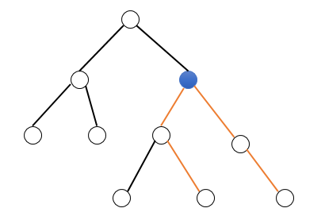

# AcWing 2019暑期LeetCode刷题班 


### 活动详情
- 本活动组织暑期刷LeetCode题目。
- 我们会精选80道高频题，每周10道，持续八周，每周一个专题。
- 每周日北京时间19:00-21:00直播讲本周布置的题目。直播录像会上传到b站。

### 激励机制
- 报名时收取80元报名费，活动结束一个月内，打卡60%题目，会全额返报名费！
- 题目以周为单位，只要本周做完6道题目，则会立即返 80 / 8 = 10元，最晚24小时到账。

### 参与方式
- 每天写完相应题目后，在”打卡”栏目（报名后可见）中选择对应位置，提交Accept的代码即可。
- 如果刷题时遇到任何问题，可以在问答页面发帖提问，我们会第一时间解答。

### 活动交流
- 欢迎加入我们的微信群！
- 添加我们的acwing微信小助手，留言“暑期LeetCode打卡活动”，微信号是acwinghelper。
- 或者加入QQ群：728297306。

### 报名方式
- [活动报名链接](https://www.acwing.com/activity/content/12/): https://www.acwing.com/activity/content/12/


# Week 3 树

- 98. 判断BST
- 101. 判断镜像二叉树
- 94. 二叉树的中序遍历
- 105. 用前序遍历和中序遍历重建二叉树
- 102. 层序遍历
- 236. 最近公共祖先
- 297. 序列化与反序列化二叉树
- 543. 树的直径
- 124. 路径权值和的最大值
- 173. BST后继迭代器

<div style="page-break-after: always;"></div>

## Tree 1: Leetcode 98. 判断BST

[//]: # (推荐题解模板，请替换blablabla等内容 ^^)

### 题目描述

给定一棵二叉树，判断它是否是一棵合法的二叉搜索树(BST)。

二叉搜索树需要满足如下条件：

- 左子树的所有节点的值都小于当前节点的值；
- 右子树的所有节点的值都大于当前节点的值；
- 左子树和右子树都必须是合法的二叉搜索树；


#### 样例1

```
输入：
    2
   / \
  1   3
输出：true
```

#### 样例2

```
输入：
    5
   / \
  1   4
     / \
    3   6
输出：false
解释：输入是 5,1,4,null,null,3,6]. 根节点的值是5，
      但其右儿子的值是4。
```

----------

### 算法
##### (深度优先遍历)  $O(n)$

深度优先遍历整棵子树。
遍历时，需要向上传递当前子树中的最小值和最大值，这里可以用C++中的引用来专递。
对于当前节点，我们先遍历它的左子树，判断左子树是否合法，同时判断左子树的最大值是否小于当前节点的值；然后遍历右子树，判断右子树是否合法，同时判断右子树的最小值是否大于当前节点的值。
如果条件均满足，说明以当前节点为根的子树是一棵合法的二叉搜索树，返回true。


时间复杂度分析：树中每个节点仅被遍历一遍，所以时间复杂度是 $O(n)$。

<div style="page-break-after: always;"></div>

#### C++ 代码
```
/**
 * Definition for a binary tree node.
 * struct TreeNode {
 *     int val;
 *     TreeNode *left;
 *     TreeNode *right;
 *     TreeNode(int x) :
            val(x), left(NULL), right(NULL) {}
 * };
 */
class Solution {
public:
    bool isValidBST(TreeNode* root) {
        if (!root) return true;
        int maxv, minv;
        return dfs(root, maxv, minv);
    }
    
    bool dfs(TreeNode* root, int &maxv, int &minv)
    {
        maxv = minv = root->val;
        if (root->left)
        {
            int nowMaxv, nowMinv;
            if (!dfs(root->left, nowMaxv, nowMinv))
                return false;
            if (nowMaxv >= root->val)
                return false;
            maxv = max(maxv, nowMaxv);
            minv = min(minv, nowMinv);
        }
        if (root->right)
        {
            int nowMaxv, nowMinv;
            if (!dfs(root->right, nowMaxv, nowMinv))
                return false;
            if (nowMinv <= root->val)
                return false;
            maxv = max(maxv, nowMaxv);
            minv = min(minv, nowMinv);
        }
        return true;
    }
};
```

<div style="page-break-after: always;"></div>


## Tree 2: Leetcode 101. 判断镜像二叉树

[//]: # (推荐题解模板，请替换blablabla等内容 ^^)

### 题目描述

给定一个二叉树，判断它是否是自己的“镜像”（是否以中心竖线为轴左右对称）。

__注意__:如果同时给出递归和迭代方法，会获得加分。

#### 样例1

如下二叉树 `[1,2,2,3,4,4,3]` 是自己的“镜像”：
```
    1
   / \
  2   2
 / \ / \
3  4 4  3
```

#### 样例2

如下二叉树 `[1,2,2,null,3,null,3]` 不是自己的“镜像”：
```
    1
   / \
  2   2
   \   \
   3    3
```

----------

### 算法1
##### (递归)  $O(n)$

递归判断两个子树是否互为镜像。

两个子树互为镜像当且仅当：

1. 两个子树的根节点值相等；
2. 第一棵子树的左子树和第二棵子树的右子树互为镜像，且第一棵子树的右子树和第二棵子树的左子树互为镜像；

时间复杂度分析：从上到下每个节点仅被遍历一遍，所以时间复杂度是 $O(n)$。

<div style="page-break-after: always;"></div>

#### C++ 代码
```
/**
 * Definition for a binary tree node.
 * struct TreeNode {
 *     int val;
 *     TreeNode *left;
 *     TreeNode *right;
 *     TreeNode(int x) : val(x), left(NULL), right(NULL) {}
 * };
 */
class Solution {
public:
    bool isSymmetric(TreeNode* root) {
        return !root || dfs(root->left, root->right);
    }
    
    bool dfs(TreeNode*p, TreeNode*q)
    {
        if (!p || !q) return !p && !q;
        return p->val == q->val && dfs(p->left, q->right) && dfs(p->right, q->left);
    }
};
```

----------

<div style="page-break-after: always;"></div>

### 算法2
##### (迭代)  $O(n)$

用栈模拟递归，对根节点的左子树，我们用中序遍历；对根节点的右子树，我们用反中序遍历。
则两个子树互为镜像，当且仅当同时遍历两课子树时，对应节点的值相等。

时间复杂度分析：树中每个节点仅被遍历一遍，所以时间复杂度是 $O(n)$。


#### C++ 代码
```
/**
 * Definition for a binary tree node.
 * struct TreeNode {
 *     int val;
 *     TreeNode *left;
 *     TreeNode *right;
 *     TreeNode(int x) : val(x), left(NULL), right(NULL) {}
 * };
 */
class Solution {
public:
    bool isSymmetric(TreeNode* root) {
        if (!root) return true;
        stack<TreeNode*> left, right;
        TreeNode *lc = root->left;
        TreeNode *rc = root->right;
        while(lc || rc || left.size())
        {
            while (lc && rc)
            {
                left.push(lc), right.push(rc);
                lc = lc->left, rc = rc->right;
            }
            if (lc || rc) return false;
            lc = left.top(), rc = right.top();
            left.pop(), right.pop();
            if (lc->val != rc->val) return false;
            lc = lc->right, rc = rc->left;
        }
        return true;
    }
    
};
```

<div style="page-break-after: always;"></div>


## Tree 3: Leetcode 94. 二叉树的中序遍历

[//]: # (推荐题解模板，请替换blablabla等内容 ^^)

### 题目描述

给定一个二叉树，请返回它的中序遍历。
请使用 __非递归__ 方法。


#### 样例

```
输入：[1,null,2,3]
   1
    \
     2
    /
   3

输出：[1,3,2]
```


----------

### 算法
##### (栈模拟递归)  $O(n)$

如果用递归方法做，我们在处理每个节点时，要按照 左子树 => 根节点 => 右子树的顺序进行遍历，如下所示:
```
void dfs(TreeNode *u)
{
    if (!u) return;
    dfs(u->left);
    cout << u->val << ' ';
    dfs(u->right);
}
```

可以用栈来模拟这个过程。栈中每个元素存储两个值：TreeNode节点和一个整型的标记。

- 标记 = 0，表示还没遍历该节点的左子树；
- 标记 = 1，表示已经遍历完左子树，但还没遍历右子树；
- 标记 = 2，表示已经遍历完右子树；

然后我们可以根据标记的值，来分别处理各种情况：

- 标记 = 0，则将该节点的标记改成1，然后将其左儿子压入栈中；
- 标记 = 1，则说明左子树已经遍历完，将根节点的值插入答案序列中，然后将该节点的标记改成2，并将右儿子压入栈中；
- 标记 = 2，则说明以该节点为根的子树已经遍历完，直接从栈中弹出即可；


时间复杂度分析：树中每个节点仅会遍历一遍，且进栈出栈一次，所以时间复杂度是 $O(n)$。

<div style="page-break-after: always;"></div>

#### C++ 代码
```
/**
 * Definition for a binary tree node.
 * struct TreeNode {
 *     int val;
 *     TreeNode *left;
 *     TreeNode *right;
 *     TreeNode(int x) : val(x), left(NULL), right(NULL) {}
 * };
 */
class Solution {
public:
    vector<int> inorderTraversal(TreeNode* root) {
        vector<int> res;
        stack<pair<TreeNode*, int>>sta;
        sta.push(make_pair(root, 0));
        while (!sta.empty())
        {
            if (sta.top().first == NULL)
            {
                sta.pop();
                continue;
            }
            int t = sta.top().second;
            if (t == 0)
            {
                sta.top().second = 1;
                sta.push(make_pair(sta.top().first->left, 0));
            }
            else if (t == 1)
            {
                res.push_back(sta.top().first->val);
                sta.top().second = 2;
                sta.push(make_pair(sta.top().first->right, 0));
            }
            else sta.pop();
        }
        return res;
    }
};
```

<div style="page-break-after: always;"></div>


## Tree 4: Leetcode 105. 用前序遍历和中序遍历重建二叉树

[//]: # (推荐题解模板，请替换blablabla等内容 ^^)

### 题目描述

给定一棵二叉树的前序遍历和中序遍历，请复原出整棵二叉树。

__注意__：二叉树中没有值相同的节点。

#### 样例

给定：
```
前序遍历是：[3,9,20,15,7]
中序遍历是：[9,3,15,20,7]
```

返回的二叉树如下所示：
```
    3
   / \
  9  20
    /  \
   15   7
```


----------

### 算法
##### (递归)  $O(n)$

递归建立整棵二叉树：先递归创建左右子树，然后创建根节点，并让指针指向两棵子树。

具体步骤如下：

1. 先利用前序遍历找根节点：前序遍历的第一个数，就是根节点的值；
2. 在中序遍历中找到根节点的位置 $k$，则 $k$ 左边是左子树的中序遍历，右边是右子树的中序遍历；
3. 假设左子树的中序遍历的长度是 $l$，则在前序遍历中，根节点后面的 $l$ 个数，是左子树的前序遍历，剩下的数是右子树的前序遍历；
4. 有了左右子树的前序遍历和中序遍历，我们可以先递归创建出左右子树，然后再创建根节点；


时间复杂度分析：我们在初始化时，用哈希表(`unordered_map<int,int>`)记录每个值在中序遍历中的位置，这样我们在递归到每个节点时，在中序遍历中查找根节点位置的操作，只需要 $O(1)$ 的时间。此时，创建每个节点需要的时间是 $O(1)$，所以总时间复杂度是 $O(n)$。

<div style="page-break-after: always;"></div>

#### C++ 代码
```
/**
 * Definition for a binary tree node.
 * struct TreeNode {
 *     int val;
 *     TreeNode *left;
 *     TreeNode *right;
 *     TreeNode(int x) : val(x), left(NULL), right(NULL) {}
 * };
 */
class Solution {
public:
    
    unordered_map<int,int> pos;
    
    TreeNode* buildTree(vector<int>& preorder, vector<int>& inorder) {
        int n = preorder.size();
        for (int i = 0; i < n; i ++ )
            pos[inorder[i]] = i;
        return dfs(preorder, inorder, 0, n - 1, 0, n - 1);
    }
    
    TreeNode* dfs(vector<int>&pre, vector<int>&in, int pl, int pr, int il, int ir)
    {
        if (pl > pr) return NULL;
        int k = pos[pre[pl]] - il;
        TreeNode* root = new TreeNode(pre[pl]);
        root->left = dfs(pre, in, pl + 1, pl + k, il, il + k - 1);
        root->right = dfs(pre, in, pl + k + 1, pr, il + k + 1, ir);
        return root;
    }
};
```

<div style="page-break-after: always;"></div>


## Tree 5: Leetcode 102. 层序遍历

[//]: # (推荐题解模板，请替换blablabla等内容 ^^)

### 题目描述

给定一棵二叉树，返回它的层序遍历。（即从上到下，从左到右，一层一层地遍历）


#### 样例

给定二叉树 `[3,9,20,null,null,15,7]`：
```
    3
   / \
  9  20
    /  \
   15   7
```

它的层序遍历结果是：
```
[
  [3],
  [9,20],
  [15,7]
]
```

----------

### 算法
##### (BFS)  $O(n)$

宽度优先遍历，一层一层来做。即：

1. 将根节点插入队列中；
2. 创建一个新队列，用来按顺序保存下一层的所有子节点；
3. 对于当前队列中的所有节点，按顺序依次将儿子加入新队列，并将当前节点的值记录在答案中；
4. 重复步骤2-3，直到队列为空为止。

时间复杂度分析：树中每个节点仅会进队出队一次，所以时间复杂度是 $O(n)$。

<div style="page-break-after: always;"></div>

#### C++ 代码
```
/**
 * Definition for a binary tree node.
 * struct TreeNode {
 *     int val;
 *     TreeNode *left;
 *     TreeNode *right;
 *     TreeNode(int x) : val(x), left(NULL), right(NULL) {}
 * };
 */
class Solution {
public:
    vector<int> get_val(vector<TreeNode*> level)
    {
        vector<int> res;
        for (auto &u : level)
            res.push_back(u->val);
        return res;
    }
    
    vector<vector<int>> levelOrder(TreeNode* root) {
        vector<vector<int>>res;
        if (!root) return res;
        vector<TreeNode*>level;
        level.push_back(root);
        res.push_back(get_val(level));
        while (true)
        {
            vector<TreeNode*> newLevel;
            for (auto &u : level)
            {
                if (u->left) newLevel.push_back(u->left);
                if (u->right) newLevel.push_back(u->right);
            }
            if (newLevel.size())
            {
                res.push_back(get_val(newLevel));
                level = newLevel;
            }
            else break;
        }
        return res;
    }
};
```

<div style="page-break-after: always;"></div>


## Tree 6: Leetcode 236. 最近公共祖先

[//]: # (推荐题解模板，请替换blablabla等内容 ^^)

### 题目描述

给定一课二叉树，找到其中指定两个点的最近公共祖先 (LCA)。

根据Wikipedia中[LCA的定义](https://en.wikipedia.org/wiki/Lowest_common_ancestor) ：“最近公共祖先定义为两个结点 p 和 q 之间，树中最低的结点同时拥有 p 和 q 作为后代(这里允许一个结点的后代为它本身)。

#### 注意
* 树中每个结点的权值都是唯一的。
* p 和 q是两个不同的结点，且其值必定在二叉树中出现。


#### 样例

```
Given the following binary search tree:  root = [3,5,1,6,2,0,8,null,null,7,4]

        _______3______
       /              \
    ___5__          ___1__
   /      \        /      \
   6      _2       0       8
         /  \
         7   4


Example 1:

Input: root = [3,5,1,6,2,0,8,null,null,7,4], p = 5, q = 1
Output: 3
解释: 结点 5 和 1 的最近公共祖先是 3。


Example 2:

Input: root = [3,5,1,6,2,0,8,null,null,7,4], p = 5, q = 4
Output: 5
Explanation: 结点 5 和 4 的最近公共祖先是 5, 因为根据后代结点的定义，一个结点的后代允许为它本身。
```


----------

### 算法
##### (DFS)  $O(n)$

1. 此题与[Lowest Common Ancestor of a Binary Search Tree](https://www.acwing.com/solution/leetcode/content/281/) 最大的不同就是这道题给定的二叉树不再是二叉查找树。
2. 所以我们需要通过遍历整棵树，分别找到 p 和 q 结点到根结点的路径，然后枚举匹配路径上的点找到最近公共祖先。
3. 遍历的算法采用的深度优先搜索，搜索时，需要一个数组记录路径；在每一层尝试两个方向的路径，如果某一个方向找到了目标结点或者当前点就是目标结点，则当且结点加入数组，并返回 true；否则返回 false。
4. 最后根据两个数组的路径，找到最低的公共结点即可。

#### 时间复杂度
* 由于需要遍历整棵树，每个结点仅遍历两次，故时间复杂度为$O(n)$。


#### C++ 代码
```
/**
 * Definition for a binary tree node.
 * struct TreeNode {
 *     int val;
 *     TreeNode *left;
 *     TreeNode *right;
 *     TreeNode(int x) : val(x), left(NULL), right(NULL) {}
 * };
 */
class Solution {
public:
    
    bool dfs(TreeNode *cur, TreeNode *des, vector<TreeNode*> &path_node) {
        if (cur == NULL)
            return false;
        if (cur == des) {
            path_node.push_back(cur);
            return true;
        }
        if (dfs(cur -> left, des, path_node) || dfs(cur -> right, des, path_node)) {
            path_node.push_back(cur);
            return true;
        }
        
        return false;
    }
    
    TreeNode* lowestCommonAncestor(TreeNode* root, TreeNode* p, TreeNode* q) {
        vector<TreeNode*> path_node_p, path_node_q;
        dfs(root, p, path_node_p);
        dfs(root, q, path_node_q);
        reverse(path_node_p.begin(), path_node_p.end());
        reverse(path_node_q.begin(), path_node_q.end());
        
        int n = min(path_node_p.size(), path_node_q.size());
        for (int i = n - 1; i >= 0; i--)
            if (path_node_p[i] == path_node_q[i])
                return path_node_p[i];
        
        return NULL;
    }
};
```

<div style="page-break-after: always;"></div>


## Tree 7: Leetcode 297. 序列化与反序列化二叉树

[//]: # (推荐题解模板，请替换blablabla等内容 ^^)

### 题目描述

序列化是将一个数据结构或对象转换成二进制序列使其能够存储在文件或内存缓冲区，或者通过网络链接传递。之后可以在相同或另一个计算机环境中重新构造该对象。

设计一个算法实现序列化和反序列化一个二叉树，序列化和反序列化的算法没有限制，只需要保证可以将二叉树序列化为字符串，然后该字符串可以被反序列化为原始的树结构。

#### 注意
* 不得使用类成员、全局或者静态变量存储状态，序列化和反序列化算法不能和状态有关。

#### 样例

```
你可以序列化如下的二叉树

    1
   / \
  2   3
     / \
    4   5

为 "[1,2,3,null,null,4,5]"
```

#### 声明
* 以上的格式是 [LeetCode序列化二叉树](https://leetcode.com/faq/#binary-tree) 的方式，你不必一定按照此格式，所以可以设计出一些新的构造方式。

----------

### 算法
##### (先序遍历序列化)  $O(n)$

1. 我们按照先序遍历，即可完整唯一的序列化一棵二叉树。但空结点需要在序列化中有所表示。
2. 例如样例中的二叉树可以表示为 `"1,2,n,n,3,4,n,n,5,n,n,"`，其中`n`可以去掉，进行简化。
3. 通过DFS即可序列化该二叉树；反序列化时，按照 `,`作为分隔，构造当前结点后分别通过递归构造左右字数即可。

#### 时间复杂度
* 每个结点仅遍历两次，故时间复杂度为$O(n)$。


#### C++ 代码
```
/**
 * Definition for a binary tree node.
 * struct TreeNode {
 *     int val;
 *     TreeNode *left;
 *     TreeNode *right;
 *     TreeNode(int x) : val(x), left(NULL), right(NULL) {}
 * };
 */
class Codec {
public:
    
    void dfs(TreeNode* root, string& s) {
        if (root == NULL) {
            s += ",";
            return;
        }
        s += to_string(root -> val) + ",";
        dfs(root -> left, s);
        dfs(root -> right, s);
    }
    // Encodes a tree to a single string.
    string serialize(TreeNode* root) {
        string s = "";
        dfs(root, s);
        return s;
    }
    
    TreeNode* decode(int &cur, const string& data) {
        if (data[cur] == ',') {
            cur++;
            return NULL;
        }
        int nxt = data.find(',', cur);
        int val = stoi(data.substr(cur, nxt - cur));
        TreeNode *r = new TreeNode(val);
        cur = nxt + 1;
        r -> left = decode(cur, data);
        r -> right = decode(cur, data);
        return r;
    }
    // Decodes your encoded data to tree.
    TreeNode* deserialize(string data) {
        int cur = 0;
        return decode(cur, data);
    }
};

// Your Codec object will be instantiated and called as such:
// Codec codec;
// codec.deserialize(codec.serialize(root));
```

<div style="page-break-after: always;"></div>


## Tree 8: Leetcode 543. 树的直径

[//]: # (推荐题解模板，请替换blablabla等内容 ^^)

### 题目描述

给定一棵二叉树，你需要计算它的直径长度。一棵二叉树的直径长度是任意两个结点路径长度中的**最大值**。这条路径穿过或者不穿过根结点。


#### 样例

```
给定二叉树

          1
         / \
        2   3
       / \     
      4   5    
      
返回 3, 它是路径 [4,2,1,3] 或者 [5,2,1,3] 的长度。
```


----------

### 算法
##### (递归遍历)  $O(n)$

1. 递归函数的返回值定义为从当前结点到叶子结点的最大长度，当前结点为空返回 -1。
2. 递归时，分别得到左右子树递归的返回值，则可以更新答案 ans = max(ans, d1 + d2 + 2)；然后返回 max(d1, d2) + 1。

#### 时间复杂度
* 每个结点最多仅被遍历一次，故时间复杂度为 $O(n)$。

<div style="page-break-after: always;"></div>

#### C++ 代码
```
/**
 * Definition for a binary tree node.
 * struct TreeNode {
 *     int val;
 *     TreeNode *left;
 *     TreeNode *right;
 *     TreeNode(int x) : val(x), left(NULL), right(NULL) {}
 * };
 */
class Solution {
public:
    int dfs(TreeNode *r, int &ans) {
        if (r == NULL)
            return -1;
        int d1 = dfs(r -> left, ans);
        int d2 = dfs(r -> right, ans);
        ans = max(ans, d1 + d2 + 2);
        return max(d1, d2) + 1;
    }
    int diameterOfBinaryTree(TreeNode* root) {
        int ans = 0;
        dfs(root, ans);
        return ans;
    }
};
```

<div style="page-break-after: always;"></div>


## Tree 9: Leetcode 124. 路径权值和的最大值

[//]: # (推荐题解模板，请替换blablabla等内容 ^^)

### 题目描述

给定一个非空二叉树，找到路径权值和的最大值。
在这道题目中，路径是指从树中某个节点开始，沿着树中的边走，走到某个节点为止，路过的所有节点的集合。
路径的权值和是指路径中所有节点的权值的总和。


#### 样例1

```
输入：[1,2,3]

       1
      / \
     2   3

输出：6
```

#### 样例2

```
输入：[-10,9,20,null,null,15,7]

   -10
   / \
  9  20
    /  \
   15   7

输出：42
```


----------

### 算法
##### (递归，树的遍历)  $O(n^2)$

树中每条路径，都存在一个离根节点最近的点，我们把它记为割点，用割点可以将整条路径分为两部分：从该节点向左子树延伸的路径，和从该节点向右子树延伸的部分，而且两部分都是自上而下延伸的。如下图所示，蓝色的节点为割点：




我们可以递归遍历整棵树，递归时维护从每个节点开始往下延伸的最大路径和。
对于每个点，递归计算完左右子树后，我们将左右子树维护的两条最大路径，和该点拼接起来，就可以得到以这个点为割点的最大路径。
然后维护从这个点往下延伸的最大路径：从左右子树的路径中选择权值大的一条延伸即可。


时间复杂度分析：每个节点仅会遍历一次，所以时间复杂度是 $O(n)$。


#### C++ 代码
```
/**
 * Definition for a binary tree node.
 * struct TreeNode {
 *     int val;
 *     TreeNode *left;
 *     TreeNode *right;
 *     TreeNode(int x) : val(x), left(NULL), right(NULL) {}
 * };
 */
class Solution {
public:
    int ans;
    int maxPathSum(TreeNode* root) {
        ans = INT_MIN;
        dfs(root);
        return ans;
    }
    
    int dfs(TreeNode* root)
    {
        if (!root) return 0;
        int left = max(0, dfs(root->left));
        int right = max(0, dfs(root->right));
        ans = max(ans, left + root->val + right);
        return root->val + max(left, right);
    }
};
```

<div style="page-break-after: always;"></div>


## Tree 10: Leetcode 173. BST后继迭代器

[//]: # (推荐题解模板，请替换blablabla等内容 ^^)

### 题目描述

实现一个遍历二叉查找树的迭代器（用根结点初始化）。
调用`next()`方法将返回二叉查找树中的一个后继。

#### 注意
`next()`方法和`hasNext()`方法的时间复杂度为均摊`O(1)`，空间复杂度为`O(h)`。


----------

### 算法
##### (栈)

1. 用栈来模拟BST的中序遍历过程，当前结点进栈，代表它的左子树正在被访问。栈顶结点代表当前访问到的结点。
2. 求后继时，只需要弹出栈顶结点，取出它的值。然后将它的右儿子以及右儿子的左儿子等一系列结点进栈，这一步代表找右子树中的最左子结点，并记录路径上的所有结点。
3. 判断是否还存在后继只需要判断栈是否为空即可，因为栈顶结点是下一次即将被访问到的结点。

<div style="page-break-after: always;"></div>

#### C++ 代码
```
/**
 * Definition for binary tree
 * struct TreeNode {
 *     int val;
 *     TreeNode *left;
 *     TreeNode *right;
 *     TreeNode(int x) : val(x), left(NULL), right(NULL) {}
 * };
 */
class BSTIterator {
public:
    stack<TreeNode*> st;
    BSTIterator(TreeNode *root) {
        TreeNode *p = root;
        while (p) {
            st.push(p);
            p = p -> left;
        }
    }

    /** @return whether we have a next smallest number */
    bool hasNext() {
        return !st.empty();
    }

    /** @return the next smallest number */
    int next() {
        TreeNode *cur = st.top();
        st.pop();
        int v = cur -> val;
        cur = cur -> right;
        while (cur) {
            st.push(cur);
            cur = cur -> left;
        }
        return v;
    }
};

/**
 * Your BSTIterator will be called like this:
 * BSTIterator i = BSTIterator(root);
 * while (i.hasNext()) cout << i.next();
 */
```


<div style="page-break-after: always;"></div>

# 专题回顾与预告

|  Week 1 二分  | Week 2 链表  | Week 3 树 |
|  ----  | ----  | ----  |
| 69. Sqrt(x)  | 19. 删除第n个节点 |98. 判断BST |
| 35. 查找插入位置 | 237. 删除某个节点 |101. 判断镜像二叉树 |
| 34. 查找数的范围  | 83. 删除重复节点  |94. 二叉树中序遍历 |
| 74. 在二维矩阵中查找  | 61. 旋转链表  |105. 重建二叉树 |
| 153. 查找最小值  | 24. 交换相邻节点  |102. 层序遍历 |
| 33. 搜索旋转排序数组  | 206. 翻转链表  |236. 最近公共祖先 |
| 278. 第一个失败版本  | 92. 翻转链表2  |297. 序列化与反序列化 |
| 162. 查找峰值  | 160. 两个链表的交点  |543. 树的直径 |
| 287. 查找重复元素  | 142. 链表中环的入口  |124. 路径权值和的最大值 |
| 275. H-索引II  | 148. 链表排序  |173. BST后继迭代器 |


- Week4 字符串处理
- Week5 搜索
- Week6 滑动窗口、双指针与单调队列
- Week7 基本数据结构
- Week8 动态规划


# 往期活动

欢迎关注微信公众号 AcWing


- [算法基础课](https://www.acwing.com/activity/content/introduction/11/)
- [算法面试、笔试题公开课](https://www.acwing.com/activity/content/introduction/8/)
- [《算法竞赛进阶指南》打卡活动] (https://www.acwing.com/activity/content/introduction/6/)
- [《剑指Offer》打卡活动](https://www.acwing.com/activity/content/introduction/5/)
- [LeetCode提高班——第4期](https://www.acwing.com/activity/content/introduction/4/)
- [LeetCode提高班——第3期](https://www.acwing.com/activity/content/introduction/3/)
- [LeetCode提高班——第2期](https://www.acwing.com/activity/content/introduction/2/)
- [LeetCode提高班——第1期](https://www.acwing.com/activity/content/introduction/1/)


更多题解尽在[Acwing](https://www.acwing.com/solution/leetcode/)
